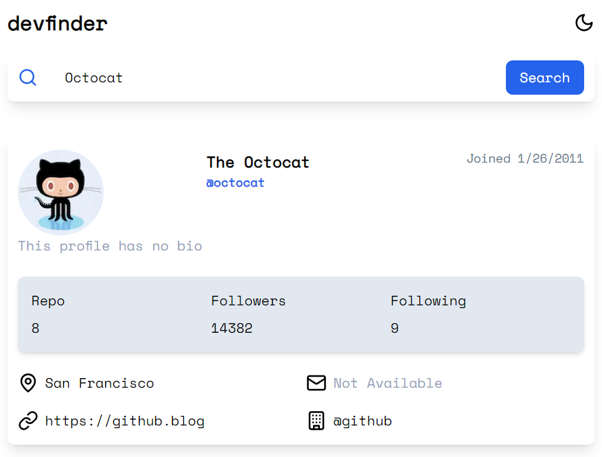

# Github User Finder

Step 1: Clone the repo

```
git clone <repo> <directory>
```

Step 2 : Install all dependencies

```
pnpm intall
or
npm install
```

Step 3: Run the file

```
pnpm run dev
or
npm run dev
```

## Preview



